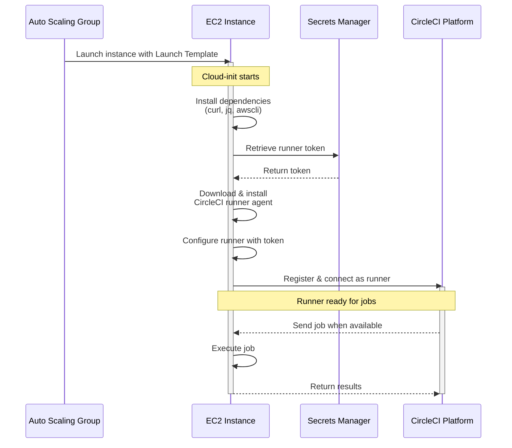
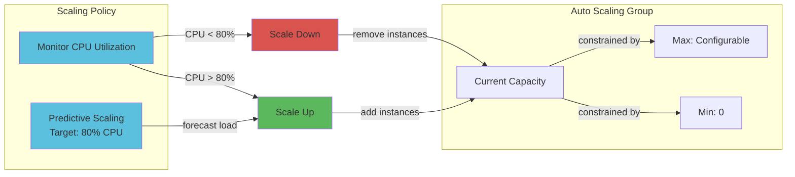

# CircleCI Machine Runner Terraform Module

A Terraform module for creating an AWS Autoscaling Group with EC2 [CircleCI Self-Hosted Linux Runners](https://circleci.com/docs/install-machine-runner-3-on-linux/)

## Disclaimer

CircleCI Labs, including this repo, is a collection of solutions developed by members of CircleCI's field engineering teams through our engagement with various customer needs.

-   ✅ Created by engineers @ CircleCI
-   ✅ Used by real CircleCI customers
-   ❌ **not** officially supported by CircleCI support

## Features

- Autoscaling Group with configurable capacity
- Launch Template with customizable instance configuration
- Predictive scaling policy based on CPU utilization
- Integration with AWS Secrets Manager for secure token management
- Cloud-init based runner setup
- Customizable tags and resource naming

## Architecture

### AWS Resources Created

This module creates and configures the following AWS resources:

```mermaid
graph TB
    subgraph "AWS VPC"
        subgraph "Subnet"
            ASG[Auto Scaling Group]
            EC2_1[EC2 Instance 1<br/>CircleCI Runner]
            EC2_2[EC2 Instance 2<br/>CircleCI Runner]
            EC2_N[EC2 Instance N<br/>CircleCI Runner]
        end
        SG[Security Group]
    end

    LT[Launch Template<br/>AMI, Instance Type, Volume]
    SP[Predictive Scaling Policy<br/>CPU-based]
    SM[AWS Secrets Manager<br/>Runner Token]

    ASG -->|launches| EC2_1
    ASG -->|launches| EC2_2
    ASG -->|launches| EC2_N
    LT -->|defines configuration| ASG
    SP -->|scales| ASG
    SG -->|controls network access| EC2_1
    SG -->|controls network access| EC2_2
    SG -->|controls network access| EC2_N
    EC2_1 -->|retrieves token| SM
    EC2_2 -->|retrieves token| SM
    EC2_N -->|retrieves token| SM

    EC2_1 -.->|connects to| CircleCI[CircleCI Platform]
    EC2_2 -.->|connects to| CircleCI
    EC2_N -.->|connects to| CircleCI

    style ASG fill:#ff9900
    style LT fill:#ff9900
    style SP fill:#ff9900
    style SM fill:#dd3522
    style SG fill:#ff9900
    style EC2_1 fill:#ff9900
    style EC2_2 fill:#ff9900
    style EC2_N fill:#ff9900
    style CircleCI fill:#343434
```



### Runner Startup Flow

When the Auto Scaling Group launches a new EC2 instance:



### Scaling Behavior

The module includes a predictive scaling policy:



## Usage

### Remote Module Reference

Use this module in your Terraform configuration by referencing it from GitHub:

```hcl
# Configure the AWS provider with your desired region
provider "aws" {
  region = "us-east-1"  # Change to your target region
}

module "circleci_runner_asg" {
  source = "git::https://github.com/CircleCI-Labs/machine-runner-linux-terraform.git//aws-terraform?ref=main"

  # Required variables
  asg_desired_capacity     = 2
  asg_max_capacity         = 5
  keypair                  = "your-keypair-name"
  subnet_id                = "subnet-xxxxxxxxx"
  security_group_id        = "sg-xxxxxxxxx"
  runner_token_secret_name = "your-runner-token-secret"

  # Optional variables
  runner_prefix     = "my-circleci-runner"
  instance_type     = "m5a.xlarge"
  availability_zone = "us-east-1a"
}
```

**Important:** The AWS provider region must match where your:
- Secrets Manager secret is stored
- VPC/subnet/security group exist
- Availability zone is located

### Minimum Required Inputs

To use this module, you **must** provide these 6 variables:

1. **`asg_desired_capacity`** - How many runners you want running (e.g., `2`)
2. **`asg_max_capacity`** - Maximum number of runners allowed (e.g., `5`)
3. **`keypair`** - Name of an existing EC2 keypair in your AWS account
4. **`subnet_id`** - ID of the subnet where runners will launch (e.g., `subnet-abc123`)
5. **`security_group_id`** - ID of the security group for runners (e.g., `sg-xyz789`)
6. **`runner_token_secret_name`** - Name of your AWS Secrets Manager secret containing the runner token

All other variables have sensible defaults and are optional.

### Prerequisites

1. AWS account with appropriate permissions
2. Terraform >= 1.5.0
3. CircleCI runner token stored in AWS Secrets Manager with this structure:
   ```json
   {
     "circleci_runner_token": "your-token-here"
   }
   ```
4. Existing VPC with subnet and security group
5. EC2 keypair created in your region

### Examples

See the [examples/basic](./examples/basic) directory for a complete working example with detailed instructions.

For OIDC-based authentication setup, see the [AWS-README.md](./aws-terraform/AWS-README.md).

## Module Inputs

| Name | Description | Type | Default | Required |
|------|-------------|------|---------|----------|
| asg_desired_capacity | Desired capacity for the autoscaling group | number | - | yes |
| asg_max_capacity | Maximum size for the autoscaling group | number | - | yes |
| keypair | EC2 keypair name | string | - | yes |
| subnet_id | Subnet ID where runners will be created | string | - | yes |
| security_group_id | Security group ID for runners | string | - | yes |
| runner_token_secret_name | AWS Secrets Manager secret name | string | - | yes |
| runner_prefix | Resource name prefix | string | "circleci_linux_runner" | no |
| instance_type | EC2 instance type | string | "m5a.xlarge" | no |
| ami_id | AMI ID for instances | string | "ami-04b70fa74e45c3917" | no |
| availability_zone | AWS availability zone | string | "us-east-1a" | no |
| volume_size | EBS volume size in GB | string | "100" | no |
| volume_type | EBS volume type | string | "gp3" | no |
| default_tags | Default tags for resources | map(string) | See variables.tf | no |

**Note:** The AWS region is configured through the AWS provider block in your root module, not as a module input variable.

## Module Outputs

| Name | Description |
|------|-------------|
| autoscaling_group_id | The ID of the autoscaling group |
| autoscaling_group_name | The name of the autoscaling group |
| autoscaling_group_arn | The ARN of the autoscaling group |
| launch_template_id | The ID of the launch template |
| launch_template_arn | The ARN of the launch template |
| launch_template_latest_version | Latest version of the launch template |
| scaling_policy_name | Name of the predictive scaling policy |
| scaling_policy_arn | ARN of the predictive scaling policy |

## Version Pinning

It's recommended to pin to a specific version/tag instead of using `main`:

```hcl
source = "git::https://github.com/CircleCI-Labs/machine-runner-linux-terraform.git//aws-terraform?ref=v1.0.0"
```

## Contributing

Contributions are welcome! Please feel free to submit a Pull Request.


